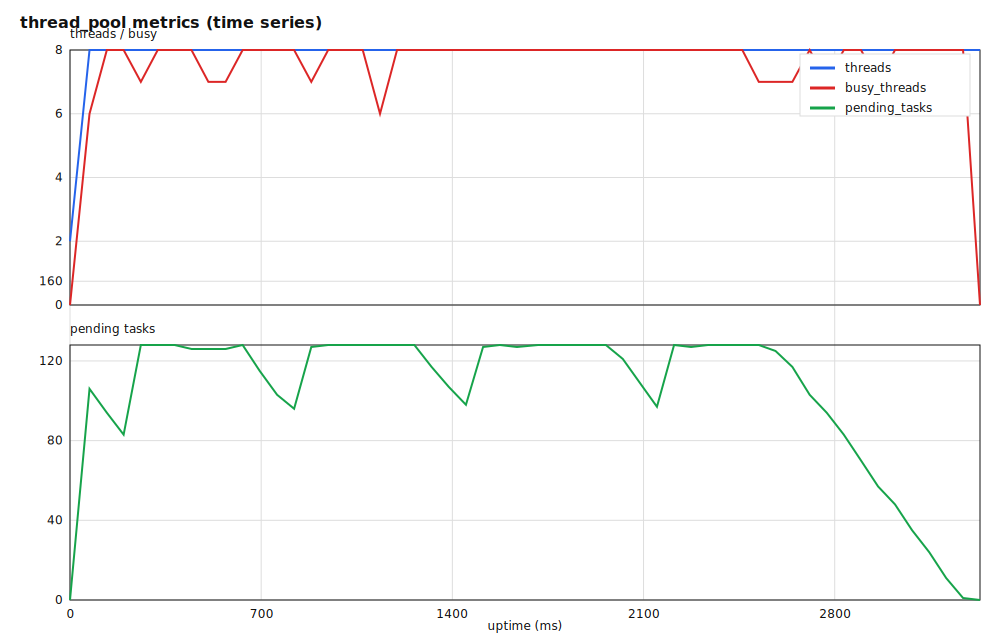
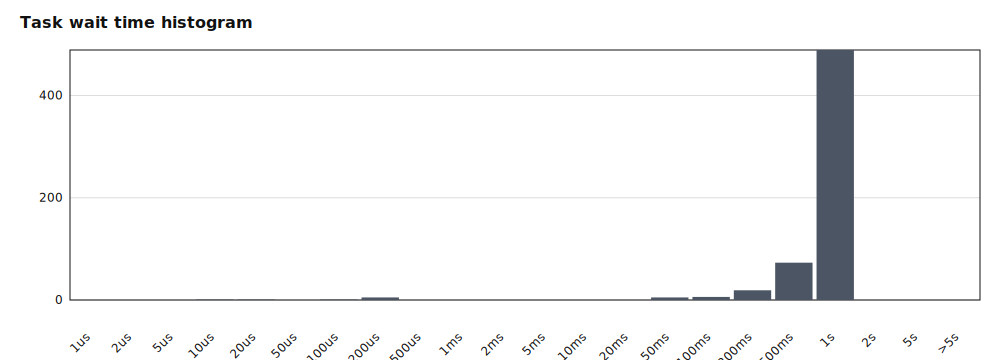
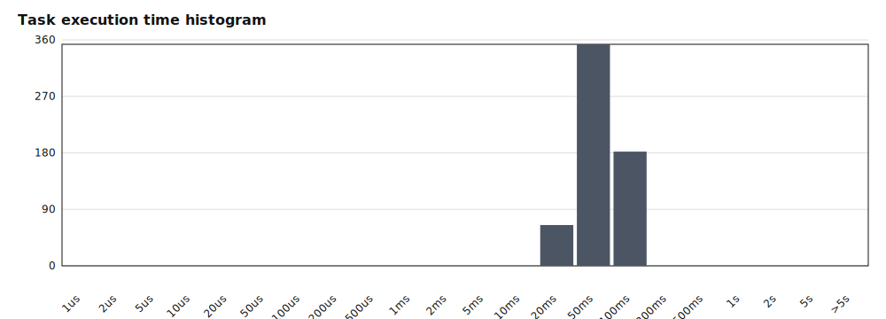

# cpp-thread-pool

一个基于 C++17 的线程池（单例）示例：动态扩缩容 + 有界队列背压 + `std::future` 回传 + 可观测性导出（CSV + SVG 图表）。

## 特性

- 动态扩缩容：`min_threads ~ max_threads`，空闲超过 `idle_timeout` 后允许缩容
- 任务提交：`submit()` 返回 `std::future<T>`（返回值/异常都能回传）
- 有界队列：`queue_capacity`（0 表示无界）+ `try_submit()` / `submit_for(timeout)`
- 队列满时拒绝策略：阻塞 / 丢弃 / 抛异常 / 调用方执行（caller-runs）
- 观测：队列长度、吞吐、等待/执行时间直方图、峰值线程数；可导出 CSV 并生成 SVG 图表

## 快速开始

### 初始化（单例）

```cpp
#include "thread_pool.h"
#include <chrono>
#include <iostream>

using namespace std::chrono_literals;

int main() {
    thread_pool::options opts;
    opts.min_threads = 2;
    opts.max_threads = 8;
    opts.idle_timeout = 800ms;
    opts.queue_capacity = 256; // 0 = unbounded
    opts.on_queue_full = thread_pool::reject_policy::block;

    auto &pool = thread_pool::instance(opts);

    auto f = pool.submit([](int x) { return x * 2; }, 21);
    std::cout << f.get() << '\n';
}
```

- `thread_pool::instance(options)`：初始化/获取线程池（单例）。
- `thread_pool::instance(min_threads, max_threads, idle_timeout)`：便捷初始化（不设置 capacity/policy 时可用）。
- `thread_pool::instance(n)`：固定大小线程池（单例），等价于最小线程数和最大线程数都为 `n`。
- `thread_pool::instance()`：无参获取已初始化实例（未初始化会抛 `not_initialized`）。

> 说明：单例第一次调用 `instance(...)` 会完成初始化；如果后续用不同参数再次调用，会抛异常以避免配置不一致。

### 提交接口

- `post(f, args...) -> void`：提交任务但不返回 future（fire-and-forget），适合高吞吐场景。
- `submit(f, args...) -> std::future<T>`：提交任务并获取返回值/异常。
- `try_submit(f, args...) -> std::optional<std::future<T>>`：不阻塞；队列满时返回空（caller-runs 例外，会直接执行并返回 future）。
- `submit_for(timeout, f, args...) -> std::optional<std::future<T>>`：最多等待 `timeout`；超时返回空（caller-runs 例外）。

兼容接口：`enqueue(f, args...)` 仍然保留（内部调用 `post`）。

### 关闭与等待

- `wait_idle()`：等待“当前”队列清空且 `busy==0`。
- `shutdown(drain)`：停止接收新任务，队列中的任务会继续执行完。
- `shutdown(cancel)`：停止接收新任务，并取消队列中尚未开始的任务（对应 future.get() 会抛 `task_canceled`）。

## 动态扩缩容策略

1. 初始化时只创建 `min_threads` 个工作线程。
2. 每次提交任务（`post` / `submit`）时，把任务放入队列（FIFO）。
3. 如果队列中的待处理任务已经多于空闲线程，并且还没到 `max_threads`，就继续创建新线程。
4. 工作线程空闲时使用 `wait_for` 挂起等待。
5. 如果等待超过 `idle_timeout` 后仍然没有任务，并且当前线程数大于 `min_threads`，这个空闲线程就会主动退出。
6. 析构时会停止接收新任务，唤醒所有线程，并把队列里剩余任务处理完再退出。

## 观测与导出

### 运行时指标

- `metrics()`：获取统计快照（队列长度、吞吐、均值等待/执行耗时、直方图、峰值线程数等）。
- `write_stats_csv(path)`：导出一条汇总快照（CSV）。
- `write_wait_histogram_csv(path)` / `write_exec_histogram_csv(path)`：导出等待/执行时间直方图（CSV）。

### 示例与图表

运行 `examples/metrics_demo.cpp` 会生成：

- `metrics_time_series.csv`
- `metrics_stats.csv`
- `metrics_wait_histogram.csv`
- `metrics_exec_histogram.csv`

然后用脚本生成 SVG（无第三方依赖）：

```bash
python scripts/plot_metrics_svg.py --out-dir docs
```





## 构建与测试

```bash
cmake -S . -B build
cmake --build build
ctest --test-dir build --output-on-failure
```

## 压力测试（带对照组）

> 说明：线程池是单例，因此每个压力场景需要在独立进程里运行；套件脚本会逐个拉起进程并汇总结果。

构建压力测试程序：

```bash
cmake -S . -B build
cmake --build build
```

运行“压力测试套件”（会输出 `bench_results.csv`）：

```bash
python scripts/run_stress_suite.py --exe build/stress_bench.exe --out bench_results.csv
```

套件包含的对照组与实验组：

- 对照组 1：`serial`（不使用线程池）
- 对照组 2：`fixed`（`min_threads == max_threads`，关闭动态扩缩容）
- 实验组：`dynamic`（`min_threads < max_threads`，开启动态扩缩容）

你也可以手动跑单个场景（程序会直接打印一行 CSV）：

```bash
build/stress_bench.exe --impl thread_pool --work spin --tasks 50000 --work-us 50 --producers 4 --min 2 --max 8 --capacity 0 --policy block
```

## 安装与 find_package

```bash
cmake --install build --prefix install
```

CMake 消费侧：

```cmake
find_package(ThreadPool CONFIG REQUIRED)
target_link_libraries(your_target PRIVATE ThreadPool::thread_pool)
```

## 示例程序

- `examples/example.cpp`：打印线程扩缩容过程。
- `examples/metrics_demo.cpp`：输出 metrics CSV + 直方图 CSV（配合脚本生成 SVG）。
